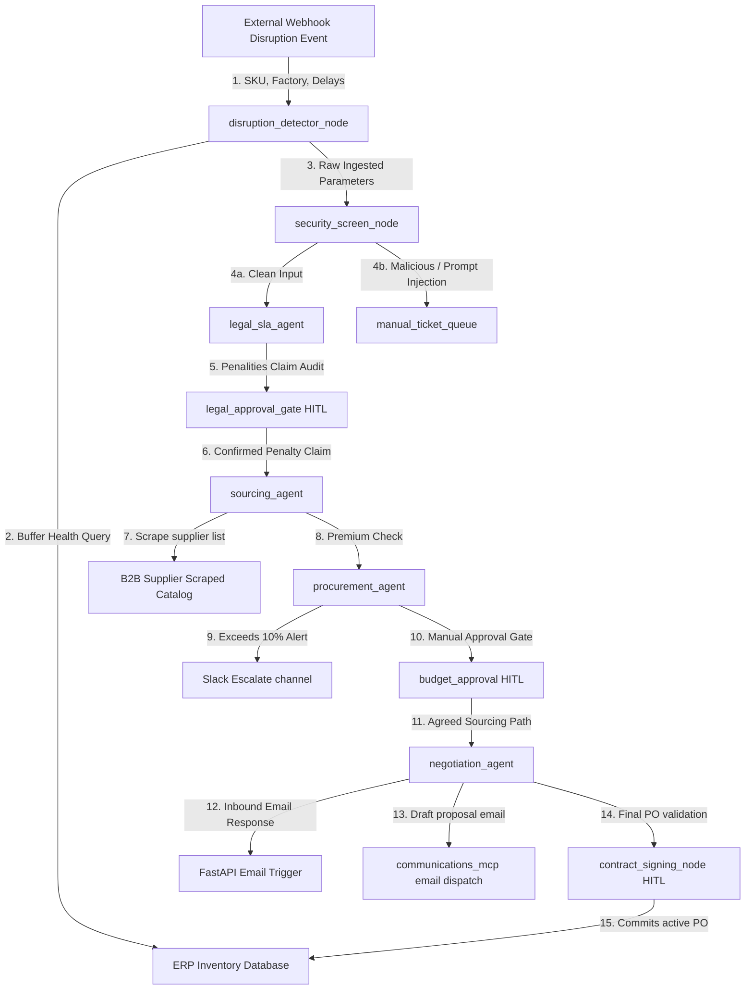

# STRIDE Threat Model Assessment: Supply-Chain Negotiator

This threat model outlines the security boundaries, data flows, potential threats, and mitigations for the `supply-chain-negotiator` multi-agent graph workflow.

## 1. System Boundaries & Data Flow

---

## 2. STRIDE Evaluation

### Spoofing (Identity Verification)
- **Threat**: Attackers could spoof external webhooks to trigger fake supply disruption alerts (DOS or financial manipulation) or inject spoofed vendor email responses to force fake PO resolutions.
- **Mitigation**:
  - Webhook endpoints `/api/sessions/trigger` and `/api/sessions/.../resume` require secure API tokens or signature verification (e.g., HMAC signature headers) when deployed to production.
  - Session IDs are generated as cryptographically secure random UUIDs (`uuid.uuid4().hex`) to prevent session guessing.

### Tampering (State or Input Manipulation)
- **Threat**: Vendors or attackers could tamper with parameters inside incoming emails or scraped B2B marketplace pages to force favorable pricing or bypass premium checks.
- **Mitigation**:
  - We apply `sanitize_text()` to strip script tags, markdown link redirections, and system override instruction phrases (e.g., "ignore previous instructions") from all scraped data and incoming emails before passing them to prompt nodes.
  - The 10% premium check is implemented as deterministic Python code in `procurement_agent`, making it impossible for the model to bypass the budget limit through prompt injection.

### Repudiation (Transaction Logging)
- **Threat**: High-stakes approvals (legal penalty waiver, budget override, PO signing) could be committed without accountability.
- **Mitigation**:
  - Every transition, human approval choice, and event is recorded immutably in the ADK session history database via the `InMemorySessionService`.
  - Operations Director digital signature approval triggers `update_active_po` committing a signed PO log to the central database.

### Information Disclosure (PII & Leakage)
- **Threat**: Sensitive corporate identifiers (internal target margins, pricing formulas) or vendor contact PII (SSNs, credit card numbers) could leak into LLM prompts, caching databases, or application log files.
- **Mitigation**:
  - We run `salt_contract_data()` on unstructured SLA PDF texts before they reach the `legal_sla_agent` or log buffers, swapping sensitive company names and manager SSNs with temporary context placeholders (`[CLIENT_CORP_SALT_A]`, `[REDACTED_SSN]`).

### Denial of Service (Resource Exhaustion)
- **Threat**: Large payloads or continuous webhook triggers could result in infinite negotiation agent loops, causing high LLM API token costs.
- **Mitigation**:
  - The negotiation wait gate implements a deterministic turn counter (`MAX_NEGOTIATION_TURNS = 4`). If resolution is not achieved in 4 turns, the workflow halts and routes directly to the manual human buyer ticket queue.

### Elevation of Privilege (Access Control)
- **Threat**: Unauthenticated users could invoke `/api/sessions/{session_id}/resume` to sign off on budget overrides or execute PO signatures.
- **Mitigation**:
  - Human-in-the-loop resume endpoints verify `session_id` and require valid user IDs. In production, authorization policies restrict PO signing actions to roles matching `Operations Director` or `Finance Manager`.
